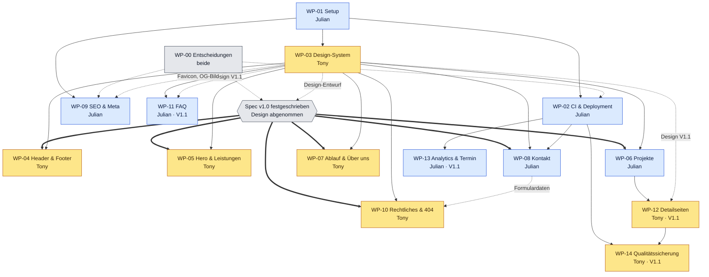

# Arbeitspakete

Hier steht, **wer was baut** und **welche Datei wem gehört**. Jedes Paket hat eine eigene Spec-Datei in diesem Ordner und ein GitHub-Issue.

- Gesamtanforderungen: [SPECS.md](../../SPECS.md)
- GitHub-Workflow (Branches, PRs, Reviews): [CONTRIBUTING.md](../../CONTRIBUTING.md)

## Übersicht

| WP | Paket | Owner | Reviewer | Release | Aufwand | Abhängig von | Issue | Branch |
|---|---|---|---|---|---|---|---|---|
| [WP-00](WP-00-entscheidungen-inhalte.md) | Entscheidungen & Inhalte | beide | – | V1.0 | M | – | [#3](https://github.com/JulianRudrich/Landingpage/issues/3) | `julian/wp-00-entscheidungen` |
| [WP-01](WP-01-projekt-setup.md) | Projekt-Setup & Gerüst | Julian | Tony | V1.0 | L | – | [#4](https://github.com/JulianRudrich/Landingpage/issues/4) | `julian/wp-01-projekt-setup` |
| [WP-02](WP-02-ci-deployment.md) | CI & Deployment | Julian | Tony | V1.0 | M | WP-01 (+ Domain aus WP-00) | [#5](https://github.com/JulianRudrich/Landingpage/issues/5) | `julian/wp-02-ci-deployment` |
| [WP-03](WP-03-design-system.md) | Design-System & BaseLayout | Tony | Julian | V1.0 | L | WP-01 | [#6](https://github.com/JulianRudrich/Landingpage/issues/6) | `tony/wp-03-design-system` |
| [WP-04](WP-04-header-footer.md) | Header & Footer | Tony | Julian | V1.0 | M | WP-03 | [#7](https://github.com/JulianRudrich/Landingpage/issues/7) | `tony/wp-04-header-footer` |
| [WP-05](WP-05-hero-leistungen.md) | Hero & Leistungen | Tony | Julian | V1.0 | M | WP-03 | [#8](https://github.com/JulianRudrich/Landingpage/issues/8) | `tony/wp-05-hero-leistungen` |
| [WP-06](WP-06-projekte.md) | Projekte | Julian | Tony | V1.0 | M | WP-03 | [#9](https://github.com/JulianRudrich/Landingpage/issues/9) | `julian/wp-06-projekte` |
| [WP-07](WP-07-ablauf-ueber-uns.md) | Ablauf & Über uns | Tony | Julian | V1.0 | M | WP-03 (+ Fotos aus WP-00) | [#10](https://github.com/JulianRudrich/Landingpage/issues/10) | `tony/wp-07-ablauf-ueber-uns` |
| [WP-08](WP-08-kontakt.md) | Kontakt-Sektion & Formular | Julian | Tony | V1.0 | L | WP-03, WP-02 | [#11](https://github.com/JulianRudrich/Landingpage/issues/11) | `julian/wp-08-kontakt` |
| [WP-09](WP-09-seo-meta.md) | SEO & Meta | Julian | Tony | V1.0 | M | WP-01 (+ Name/Region aus WP-00, Favicon/Vorschaubild aus WP-03 Teil A) | [#12](https://github.com/JulianRudrich/Landingpage/issues/12) | `julian/wp-09-seo-meta` |
| [WP-10](WP-10-rechtliches-404.md) | Impressum, Datenschutz & 404 | Tony | Julian | V1.0 | M | WP-03, WP-08 (Formulardaten) (+ Impressumsdaten aus WP-00) | [#13](https://github.com/JulianRudrich/Landingpage/issues/13) | `tony/wp-10-rechtliches-404` |
| [WP-11](WP-11-faq.md) | FAQ | Julian | Tony | V1.1 | S | WP-03 (inkl. Design V1.1) | [#14](https://github.com/JulianRudrich/Landingpage/issues/14) | `julian/wp-11-faq` |
| [WP-12](WP-12-projektdetailseiten.md) | Projektdetailseiten | Tony | Julian | V1.1 | M | WP-06, WP-03 (inkl. Design V1.1) | [#15](https://github.com/JulianRudrich/Landingpage/issues/15) | `tony/wp-12-projektdetailseiten` |
| [WP-13](WP-13-analytics-terminbuchung.md) | Analytics & Terminbuchung | Julian | Tony | V1.1 | S | WP-02 | [#16](https://github.com/JulianRudrich/Landingpage/issues/16) | `julian/wp-13-analytics-termin` |
| [WP-14](WP-14-qualitaetssicherung.md) | Qualitätssicherung | Tony | Julian | V1.1 | M | WP-02, WP-12 | [#17](https://github.com/JulianRudrich/Landingpage/issues/17) | `tony/wp-14-qualitaetssicherung` |

**Release-Issues:** [#1 V1.0 – MVP / Go-live](https://github.com/JulianRudrich/Landingpage/issues/1) · [#2 V1.1 – Ausbau](https://github.com/JulianRudrich/Landingpage/issues/2). Dort sind die Pakete als Sub-Issues angehängt, mit Fortschrittsbalken. WP-03 Teil A2 (Design V1.1) hat ein eigenes Issue unter V1.1: [#20](https://github.com/JulianRudrich/Landingpage/issues/20).

**Aufwand:** S ≈ bis 4 h · M ≈ 4–12 h · L ≈ 12–24 h (grobe Schätzung, reine Arbeitszeit)

### Verteilung

| | Julian | Tony |
|---|---|---|
| **V1.0** | WP-01 Setup (L), WP-02 CI & Deployment (M), WP-06 Projekte (M), WP-08 Kontakt (L), WP-09 SEO (M) | WP-03 Design-System (L), WP-04 Header & Footer (M), WP-05 Hero & Leistungen (M), WP-07 Ablauf & Über uns (M), WP-10 Rechtliches (M) |
| **V1.1** | WP-11 FAQ (S), WP-13 Analytics & Terminbuchung (S) | WP-12 Projektdetailseiten (M), WP-14 Qualitätssicherung (M) |
| **Summe** | 2 × L, 3 × M, 2 × S ≈ 64 h | 1 × L, 6 × M ≈ 64 h |
| **Mix** | Technik-Fundament, Formular, Projekte-UI, FAQ-Inhalte | Design-System, UI-Sektionen, Rechtstexte, Detailseiten, Test-Automatisierung |

WP-00 (Entscheidungen & Inhalte) machen beide gemeinsam.

## Reihenfolge

Durchgezogene Pfeile bedeuten „braucht den gemergten Code“, gestrichelte Pfeile „liefert Entscheidungen oder Design“. Die Sektionen werden erst gebaut, wenn die Spec festgeschrieben und Tonys Design abgenommen ist ([SPECS §12](../../SPECS.md#12-releases--scope)).

| Phase | Julian | Tony | Gemeinsam |
|---|---|---|---|
| **0 – Festlegen** | WP-01 Gerüst (mergen), danach WP-02 CI & Deployment und WP-09 SEO (Favicon und Vorschaubild erst nach der Design-Abnahme) | WP-03 Teil A: Design-Entwurf nach der „Design-Abgabe“ in der WP-03-Spec | WP-00: Entscheidungen treffen, Textvorschläge bestätigen, Fotos und Bios liefern |
| **🔒 Freigabe** | nimmt Tonys Design ab | – | Spec v1.0 festschreiben ([SPECS §16](../../SPECS.md#16-änderungsregeln)) |
| **1 – Bauen (V1.0)** | WP-06 Projekte, WP-08 Kontakt | WP-03 Teil B: Tokens und Bausteine umsetzen, dann WP-04 Header & Footer, WP-05 Hero & Leistungen, WP-07 Ablauf & Über uns, WP-10 Rechtliches | gegenseitig reviewen |
| **🚀 Release V1.0** | Release-Checkliste ([SPECS §14](../../SPECS.md#14-definition-of-done)), danach Search Console (WP-09) | Release-Checkliste | Go-live |
| **2 – Ausbau (V1.1)** | WP-13 Analytics & Terminbuchung (sofort), WP-11 FAQ (nach Design V1.1) | zu Beginn WP-03 Teil A2 (Design V1.1), dann WP-12 Detailseiten, danach WP-14 Qualitätssicherung | Julian nimmt Design V1.1 ab |

## Zuständigkeitsmatrix

**Regeln**

1. **Jede Datei existiert schon.** WP-01 hat jede Datei von V1.0 und V1.1 mit fester Schnittstelle angelegt (Props, Content-Schema, Textschlüssel, Token-Namen). Die Pakete füllen ihre Dateien nur noch aus.
2. **Jede Datei gehört genau einem Paket.** Nur dessen Owner ändert sie. Ausnahmen stehen in der Spalte „Hinweis“.
3. **Keine neuen gemeinsamen Dateien oder Schnittstellen** ohne Spec-Änderung ([SPECS §16](../../SPECS.md#16-änderungsregeln)). Erlaubt sind nur interne Hilfsdateien eines Pakets in dessen eigenem Ordner (im PR erwähnen) und neue Inhalte (Projekte, Bilder).
4. Diese Dateien legt ihr Paket selbst an, weil sie keine Schnittstelle haben; der Inhalt ist in seiner Spec vorgegeben: Konfiguration (`netlify.toml`, Workflows, `lighthouserc.json`, `playwright.config.ts`, `tests/a11y.spec.ts`, `docs/qa/`) und Grafiken aus Tonys Design (`public/favicon.ico`, `public/apple-touch-icon.png`, `public/og-image.png`, Bilder in `src/assets/hero/` und `src/assets/team/`).

### Projekt & Konfiguration

| Datei / Ordner | Paket | Owner | Hinweis |
|---|---|---|---|
| `package.json`, `package-lock.json` | WP-01 | Julian | Gemeinsam genutzt: Neue Abhängigkeiten (z. B. Schriften in WP-03) im eigenen Issue ankündigen; Lockfile-Konflikte nach [CONTRIBUTING](../../CONTRIBUTING.md#merge-konflikte-lösen) lösen |
| `astro.config.mjs` | WP-01 | Julian | `site` kommt aus `src/config/site.ts` (`url`); Skripte werden immer als Datei ausgeliefert (CSP) |
| `tsconfig.json`, `eslint.config.js`, `.prettierrc`, `.prettierignore`, `.editorconfig`, `.nvmrc`, `.npmrc`, `.gitignore`, `.vscode/extensions.json` | WP-01 | Julian | Ausgaben der Qualitäts-Tools (WP-14) sind schon ignoriert |
| `src/config/site.ts` | WP-00 | beide | Werte aus WP-00, auch `url` (= Domain). `themeColor` setzt WP-03 (Teil B) aus dem Design; später setzt WP-13 `bookingUrl` und `analytics`, WP-12 `features.projectDetails` |
| `netlify.toml` | WP-02 | Julian | legt WP-02 an; CSP-Ergänzung für die Statistik durch WP-13 |
| `.github/workflows/ci.yml` | WP-02 | Julian | legt WP-02 an |
| `.github/workflows/quality.yml` und im Hauptordner `lighthouserc.json`, `playwright.config.ts`, `tests/a11y.spec.ts` | WP-14 | Tony | legt WP-14 an; neue Dev-Abhängigkeiten im Issue ankündigen |

### Seiten (`src/pages/`)

| Datei | Paket | Owner | Hinweis |
|---|---|---|---|
| `index.astro` | WP-01 | Julian | Setzt nur die Sektionen zusammen, ändert sich danach nicht mehr |
| `styleguide.astro` | WP-03 | Tony | `noindex`, nicht in der Sitemap; interne Beschriftungen dürfen im Code stehen |
| `danke.astro` | WP-08 | Julian | |
| `robots.txt.ts`, `site.webmanifest.ts` | WP-09 | Julian | funktionieren bereits |
| `impressum.astro`, `datenschutz.astro`, `404.astro` | WP-10 | Tony | |
| `projekte/[slug].astro` | WP-12 | Tony | erzeugt bis V1.1 keine Seiten |

### Layout & Komponenten (`src/layouts/`, `src/components/`)

| Datei / Ordner | Paket | Owner | Hinweis |
|---|---|---|---|
| `layouts/BaseLayout.astro` | WP-03 | Tony | Props = Props von `SEO.astro`, unverändert durchgereicht; Slot `head` für seitenspezifische Head-Inhalte |
| `components/ui/Container.astro`, `Section.astro`, `SectionHeading.astro`, `Button.astro`, `Card.astro`, `Badge.astro`, `Icon.astro`, `icons.ts`, `Logo.astro`, `Prose.astro` | WP-03 | Tony | Props und Icon-Liste sind Schnittstellen für alle Pakete |
| `components/layout/Header.astro`, `MobileNav.astro`, `Footer.astro` | WP-04 | Tony | |
| `components/layout/SEO.astro` | WP-09 | Julian | `export interface Props` ist der Vertrag für alle Seiten |
| `components/layout/Analytics.astro` | WP-13 | Julian | |
| `components/sections/Hero.astro`, `Services.astro` | WP-05 | Tony | |
| `components/sections/Projects.astro`, `components/projects/ProjectCard.astro` | WP-06 | Julian | `ProjectCard` nutzt auch WP-12 (Props = Vertrag) |
| `components/sections/Process.astro`, `About.astro` | WP-07 | Tony | |
| `components/sections/Contact.astro`, `components/contact/ContactForm.astro` | WP-08 | Julian | |
| `components/sections/Faq.astro` | WP-11 | Julian | |
| `components/projects/ProjectHeader.astro`, `ProjectGallery.astro` | WP-12 | Tony | |

### Texte, Inhalte, Bilder, Styles

| Datei / Ordner | Paket | Owner | Hinweis |
|---|---|---|---|
| `src/i18n/index.ts`, `src/i18n/de/index.ts` | WP-01 | Julian | Hilfsfunktion, Sammeldatei, Schutz gegen `as const` |
| `src/i18n/de/common.ts` | WP-03 | Tony | |
| `src/i18n/de/navigation.ts` | WP-04 | Tony | |
| `src/i18n/de/hero.ts`, `services.ts` | WP-05 | Tony | |
| `src/i18n/de/projects.ts` | WP-06 | Julian | |
| `src/i18n/de/process.ts`, `about.ts` | WP-07 | Tony | Rollen und Bios aus WP-00 (E-14) |
| `src/i18n/de/contact.ts` | WP-08 | Julian | |
| `src/i18n/de/seo.ts` | WP-09 | Julian | Titel und Descriptions **aller** Seiten, auch Styleguide |
| `src/i18n/de/legal.ts` | WP-10 | Tony | |
| `src/i18n/de/faq.ts` | WP-11 | Julian | |
| `src/i18n/de/projectDetail.ts` | WP-12 | Tony | |
| `src/legal/impressum.md`, `src/legal/datenschutz.md` | WP-10 | Tony | Abschnitte 8 und 9 der Datenschutzerklärung ergänzt WP-13, Review durch Tony |
| `src/content.config.ts` | WP-06 | Julian | Schema ist der Vertrag mit WP-12 |
| `src/content/projects/*.md`, `src/assets/projects/*` | WP-06 | Julian | **Neue** Projektdateien darf jeder anlegen (neue Datei = kein Konflikt) |
| `src/assets/hero/*` | WP-05 | Tony | |
| `src/assets/team/*` | WP-07 | Tony | Fotos kommen aus WP-00 |
| `src/styles/global.css` | WP-03 | Tony | Token-**Namen** fest, Werte aus Tonys Design |
| `src/assets/styleguide/*` | WP-03 | Tony | Beispielbild für das Bild-Muster im Styleguide |
| `public/favicon.svg` und später `favicon.ico`, `apple-touch-icon.png`, `og-image.png` | WP-09 | Julian | Gestaltung nach Tonys Design |

### Doku & GitHub

| Datei / Ordner | Paket | Owner | Hinweis |
|---|---|---|---|
| `SPECS.md`, `CONTRIBUTING.md`, `CLAUDE.md`, `README.md`, `docs/pakete/*` | Team | beide | Änderungen per PR, Review vom anderen |
| `.github/CODEOWNERS`, `.github/pull_request_template.md`, `.github/ISSUE_TEMPLATE/*` | Team | beide | |
| `docs/qa/*` | WP-14 | Tony | Audit-Checkliste und Protokolle |

## Neues Paket anlegen

1. Spec-Datei `docs/pakete/WP-XX-kurzname.md` nach dem Muster der bestehenden anlegen (Kopfdaten, Ziel, Umfang, Dateien, Akzeptanzkriterien).
2. Issue mit der Vorlage **„Arbeitspaket“** anlegen und dem passenden Release-Issue als Sub-Issue zuordnen.
3. Tabelle **Übersicht** und ggf. **Zuständigkeitsmatrix** oben ergänzen.
4. Alles zusammen per PR nach `dev`.
