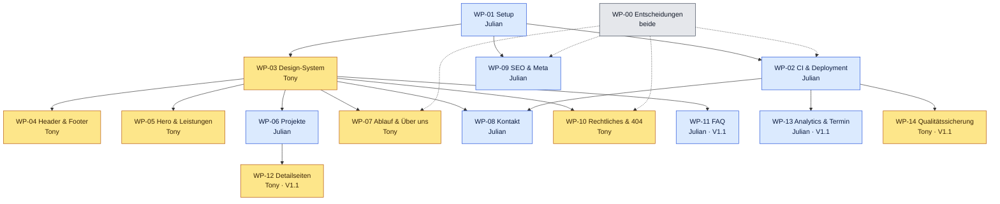

# Arbeitspakete

Hier steht, **wer was baut** und **welche Datei wem gehört**. Jedes Paket hat eine eigene Spec-Datei in diesem Ordner und ein GitHub-Issue.

- Gesamtanforderungen: [SPECS.md](../../SPECS.md)
- GitHub-Workflow (Branches, PRs, Reviews): [CONTRIBUTING.md](../../CONTRIBUTING.md)

## Übersicht

| WP | Paket | Owner | Reviewer | Release | Aufwand | Abhängig von | Issue | Branch |
|---|---|---|---|---|---|---|---|---|
| [WP-00](WP-00-entscheidungen-inhalte.md) | Entscheidungen & Inhalte | beide | – | V1.0 | M | – | [#3](https://github.com/JulianRudrich/Landingpage/issues/3) | `julian/wp-00-entscheidungen` |
| [WP-01](WP-01-projekt-setup.md) | Projekt-Setup & Gerüst | Julian | Tony | V1.0 | L | – | [#4](https://github.com/JulianRudrich/Landingpage/issues/4) | `julian/wp-01-projekt-setup` |
| [WP-02](WP-02-ci-deployment.md) | CI & Deployment | Julian | Tony | V1.0 | M | WP-01 (+ Domain aus WP-00) | [#5](https://github.com/JulianRudrich/Landingpage/issues/5) | `julian/wp-02-ci-deployment` |
| [WP-03](WP-03-design-system.md) | Design-System & BaseLayout | Tony | Julian | V1.0 | L | WP-01 | [#6](https://github.com/JulianRudrich/Landingpage/issues/6) | `tony/wp-03-design-system` |
| [WP-04](WP-04-header-footer.md) | Header & Footer | Tony | Julian | V1.0 | M | WP-03 | [#7](https://github.com/JulianRudrich/Landingpage/issues/7) | `tony/wp-04-header-footer` |
| [WP-05](WP-05-hero-leistungen.md) | Hero & Leistungen | Tony | Julian | V1.0 | M | WP-03 | [#8](https://github.com/JulianRudrich/Landingpage/issues/8) | `tony/wp-05-hero-leistungen` |
| [WP-06](WP-06-projekte.md) | Projekte | Julian | Tony | V1.0 | M | WP-03 | [#9](https://github.com/JulianRudrich/Landingpage/issues/9) | `julian/wp-06-projekte` |
| [WP-07](WP-07-ablauf-ueber-uns.md) | Ablauf & Über uns | Tony | Julian | V1.0 | M | WP-03 (+ Fotos aus WP-00) | [#10](https://github.com/JulianRudrich/Landingpage/issues/10) | `tony/wp-07-ablauf-ueber-uns` |
| [WP-08](WP-08-kontakt.md) | Kontakt-Sektion & Formular | Julian | Tony | V1.0 | L | WP-03, WP-02 | [#11](https://github.com/JulianRudrich/Landingpage/issues/11) | `julian/wp-08-kontakt` |
| [WP-09](WP-09-seo-meta.md) | SEO & Meta | Julian | Tony | V1.0 | M | WP-01 (+ Name/Region aus WP-00) | [#12](https://github.com/JulianRudrich/Landingpage/issues/12) | `julian/wp-09-seo-meta` |
| [WP-10](WP-10-rechtliches-404.md) | Impressum, Datenschutz & 404 | Tony | Julian | V1.0 | M | WP-03 (+ Impressumsdaten aus WP-00) | [#13](https://github.com/JulianRudrich/Landingpage/issues/13) | `tony/wp-10-rechtliches-404` |
| [WP-11](WP-11-faq.md) | FAQ | Julian | Tony | V1.1 | S | WP-03 | [#14](https://github.com/JulianRudrich/Landingpage/issues/14) | `julian/wp-11-faq` |
| [WP-12](WP-12-projektdetailseiten.md) | Projektdetailseiten | Tony | Julian | V1.1 | M | WP-06 | [#15](https://github.com/JulianRudrich/Landingpage/issues/15) | `tony/wp-12-projektdetailseiten` |
| [WP-13](WP-13-analytics-terminbuchung.md) | Analytics & Terminbuchung | Julian | Tony | V1.1 | S | WP-02 | [#16](https://github.com/JulianRudrich/Landingpage/issues/16) | `julian/wp-13-analytics-termin` |
| [WP-14](WP-14-qualitaetssicherung.md) | Qualitätssicherung | Tony | Julian | V1.1 | M | WP-02 | [#17](https://github.com/JulianRudrich/Landingpage/issues/17) | `tony/wp-14-qualitaetssicherung` |

**Release-Issues:** [#1 V1.0 – MVP / Go-live](https://github.com/JulianRudrich/Landingpage/issues/1) · [#2 V1.1 – Ausbau](https://github.com/JulianRudrich/Landingpage/issues/2). Dort sind die Pakete als Sub-Issues angehängt, mit Fortschrittsbalken.

**Aufwand:** S ≈ bis 4 h · M ≈ 4–12 h · L ≈ 12–24 h (grobe Schätzung, reine Arbeitszeit)

### Verteilung

| | Julian | Tony |
|---|---|---|
| **V1.0** | WP-01 Setup (L), WP-02 CI & Deployment (M), WP-06 Projekte (M), WP-08 Kontakt (L), WP-09 SEO (M) | WP-03 Design-System (L), WP-04 Header & Footer (M), WP-05 Hero & Leistungen (M), WP-07 Ablauf & Über uns (M), WP-10 Rechtliches (M) |
| **V1.1** | WP-11 FAQ (S), WP-13 Analytics & Terminbuchung (S) | WP-12 Projektdetailseiten (M), WP-14 Qualitätssicherung (M) |
| **Summe** | 2 × L, 3 × M, 2 × S ≈ 64 h | 1 × L, 6 × M ≈ 64 h |
| **Mix** | Technik-Fundament, Formular, Projekte-UI, FAQ-Inhalte | Design-System, UI-Sektionen, Rechtstexte, Detailseiten, Test-Automatisierung |

WP-00 (Entscheidungen & Inhalte) machen beide gemeinsam.

## Reihenfolge

Durchgezogene Pfeile bedeuten „braucht den gemergten Code“, gestrichelte Pfeile „braucht Inhalte oder Entscheidungen“.

| Phase | Julian | Tony | Gemeinsam |
|---|---|---|---|
| **0 – sofort** | WP-01 Setup | Design-Entwurf für WP-03 (noch ohne Code, D-09) | WP-00 starten |
| **1 – nach WP-01** | WP-02 CI & Deployment, WP-09 SEO | WP-03 Design-System | WP-00 weiter |
| **2 – nach WP-03** | WP-06 Projekte, WP-08 Kontakt | WP-04 Header & Footer, WP-05 Hero & Leistungen, WP-07 Ablauf & Über uns, WP-10 Rechtliches | Inhalte liefern, gegenseitig reviewen |
| **3 – Release V1.0** | Release-Checkliste ([SPECS §14](../../SPECS.md#14-definition-of-done)) | Release-Checkliste | Go-live 🚀 |
| **4 – V1.1** | WP-11 FAQ, WP-13 Analytics & Terminbuchung | WP-12 Detailseiten, WP-14 Qualitätssicherung | – |

## Zuständigkeitsmatrix

**Regel:** Jede Datei gehört genau einem Paket. Nur der Owner dieses Pakets ändert sie. Ausnahmen stehen in der Spalte „Hinweis“ und werden im Issue abgesprochen. WP-01 legt alle Dateien zunächst als Platzhalter an, danach übernimmt das jeweilige Paket.

### Projekt & Konfiguration

| Datei / Ordner | Paket | Owner | Hinweis |
|---|---|---|---|
| `package.json`, `package-lock.json` | WP-01 | Julian | Gemeinsam genutzt: Neue Abhängigkeiten im eigenen Issue ankündigen; Lockfile-Konflikte nach [CONTRIBUTING](../../CONTRIBUTING.md#merge-konflikte-lösen) lösen |
| `astro.config.mjs` | WP-01 | Julian | `site` (echte Domain) setzt WP-02 |
| `tsconfig.json`, `eslint.config.js`, `.prettierrc`, `.prettierignore`, `.editorconfig`, `.nvmrc`, `.gitignore` | WP-01 | Julian | |
| `src/config/site.ts` | WP-00 | beide | Gerüst von WP-01; Werte aus WP-00; `bookingUrl` und `analytics` setzt WP-13, `features.projectDetails` setzt WP-12 |
| `netlify.toml` | WP-02 | Julian | CSP-Ergänzung für die Statistik durch WP-13 |
| `.github/workflows/ci.yml` | WP-02 | Julian | |
| `.github/workflows/quality.yml`, `lighthouserc.json` | WP-14 | Tony | |

### Seiten (`src/pages/`)

| Datei | Paket | Owner | Hinweis |
|---|---|---|---|
| `index.astro` | WP-01 | Julian | Setzt nur Sektionen zusammen und ändert sich danach praktisch nie |
| `styleguide.astro` | WP-03 | Tony | optional, `noindex` |
| `danke.astro` | WP-08 | Julian | |
| `robots.txt.ts` | WP-09 | Julian | |
| `impressum.astro`, `datenschutz.astro`, `404.astro` | WP-10 | Tony | |
| `projekte/[slug].astro` | WP-12 | Tony | |

### Layout & Komponenten (`src/layouts/`, `src/components/`)

| Datei / Ordner | Paket | Owner | Hinweis |
|---|---|---|---|
| `layouts/BaseLayout.astro` | WP-03 | Tony | Bindet `SEO`, `Analytics`, `Header`, `Footer` ein (Gerüst von WP-01) |
| `components/ui/*` | WP-03 | Tony | Props sind eine Schnittstelle: Änderungen vorher ankündigen |
| `components/layout/Header.astro`, `Footer.astro` (+ ggf. `MobileNav.astro`) | WP-04 | Tony | |
| `components/layout/SEO.astro` | WP-09 | Julian | |
| `components/layout/Analytics.astro` | WP-13 | Julian | |
| `components/sections/Hero.astro`, `Services.astro` | WP-05 | Tony | |
| `components/sections/Projects.astro`, `components/projects/ProjectCard.astro` | WP-06 | Julian | |
| `components/sections/Process.astro`, `About.astro` | WP-07 | Tony | |
| `components/sections/Contact.astro`, `components/contact/*` | WP-08 | Julian | |
| `components/sections/Faq.astro` | WP-11 | Julian | |
| `components/projects/ProjectHeader.astro`, `ProjectGallery.astro` | WP-12 | Tony | |

### Texte, Inhalte, Bilder, Styles

| Datei / Ordner | Paket | Owner | Hinweis |
|---|---|---|---|
| `src/i18n/index.ts`, `src/i18n/de/index.ts` | WP-01 | Julian | Hilfsfunktion und Sammeldatei aller Bereiche |
| `src/i18n/de/common.ts` | WP-03 | Tony | allgemeine Texte (Skip-Link, „Mehr erfahren“ …) |
| `src/i18n/de/navigation.ts` | WP-04 | Tony | Menü- und Footer-Texte |
| `src/i18n/de/hero.ts`, `services.ts` | WP-05 | Tony | |
| `src/i18n/de/projects.ts` | WP-06 | Julian | |
| `src/i18n/de/process.ts`, `about.ts` | WP-07 | Tony | |
| `src/i18n/de/contact.ts` | WP-08 | Julian | |
| `src/i18n/de/seo.ts` | WP-09 | Julian | Titel und Descriptions aller Seiten |
| `src/i18n/de/legal.ts` | WP-10 | Tony | kurze Texte für Rechtsseiten und 404 |
| `src/i18n/de/faq.ts` | WP-11 | Julian | |
| `src/i18n/de/projectDetail.ts` | WP-12 | Tony | |
| `src/legal/impressum.md`, `src/legal/datenschutz.md` | WP-10 | Tony | Datenschutz-Ergänzung durch WP-13, Review durch Tony |
| `src/content.config.ts` | WP-06 | Julian | Schema ist eine Schnittstelle zu WP-12 |
| `src/content/projects/*.md`, `src/assets/projects/*` | WP-06 | Julian | **Neue** Projektdateien darf jeder anlegen (neue Datei = kein Konflikt) |
| `src/assets/hero/*` | WP-05 | Tony | |
| `src/assets/team/*` | WP-07 | Tony | Fotos kommen aus WP-00 |
| `src/styles/global.css` | WP-03 | Tony | Design-Tokens |
| `public/favicon.svg`, `favicon.ico`, `apple-touch-icon.png`, `site.webmanifest`, `og-image.png` | WP-09 | Julian | Gestaltung in Absprache mit Tony |

### Doku & GitHub

| Datei / Ordner | Paket | Owner | Hinweis |
|---|---|---|---|
| `SPECS.md`, `CONTRIBUTING.md`, `README.md`, `docs/pakete/*` | Team | beide | Änderungen per PR, Review vom anderen |
| `.github/CODEOWNERS`, `.github/pull_request_template.md`, `.github/ISSUE_TEMPLATE/*` | Team | beide | |
| `docs/qa/*` | WP-14 | Tony | Audit-Checkliste und Protokolle |

## Neues Paket anlegen

1. Spec-Datei `docs/pakete/WP-XX-kurzname.md` nach dem Muster der bestehenden anlegen (Kopfdaten, Ziel, Umfang, Dateien, Akzeptanzkriterien).
2. Issue mit der Vorlage **„Arbeitspaket“** anlegen und dem passenden Release-Issue als Sub-Issue zuordnen.
3. Tabelle **Übersicht** und ggf. **Zuständigkeitsmatrix** oben ergänzen.
4. Alles zusammen per PR nach `dev`.
